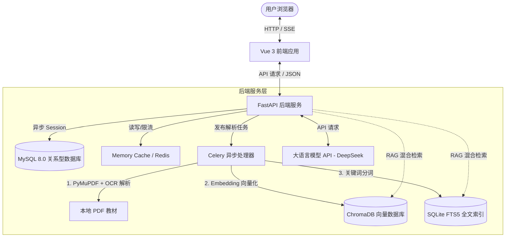

# 🎓 智能教育系统 · 知识库交互网关

> **Smart Education System (SmartEdu) — Master Portal**
>
> 这是一个基于 **Vue 3 + Vite** 前端平台 与 **FastAPI + MySQL + ChromaDB + SQLite FTS5** 后端服务构建的 AI 辅助教学平台。平台融合了 **RAG (检索增强生成) 与混合检索技术**，使学生能够针对班级授权的教材开启流式 AI 对话，同时为教师和管理员提供了全方位的班级工作台、系统配置与安全审计机制。

---

## 📂 项目结构概览

整个项目由前端与后端两个独立且紧密配合的子系统组成：

* **[app-frontend/](file:///g:/WebProject/app-frontend)**：基于 Vue 3 + Vite 8.0 构建的现代简约高精玻璃拟态前端平台。
* **[app-backend/](file:///g:/WebProject/app-backend)**：基于 FastAPI + Celery + SQLAlchemy 异步构建的后台 API 接口与异步文档解析引擎。
* **[design.md](file:///g:/WebProject/design.md)**：项目系统设计、数据库设计与核心 RAG 算法的技术设计文档。

---

## 🏗️ 系统架构设计

本系统各组件及数据流流向如下图所示：



---

## 🚀 快速开始 (Windows 本地部署)

以下是在 Windows 环境下同时运行前端和后端的完整指南。

### 前提条件要求

在运行系统前，请确保您的 Windows 系统上已安装：
1. **Node.js** (推荐 v20.x 或更高版本)
2. **Python** (推荐 3.10.x 或更高版本)
3. **MySQL 8.0**
4. **Git**（可选）

---

### 第一步：后端服务部署 (`app-backend`)

1. **进入后端目录**：
   打开命令提示符 (CMD) 或 PowerShell，进入后端文件夹：
   ```powershell
   cd g:\WebProject\app-backend
   ```

2. **创建并激活虚拟环境**：
   ```powershell
   python -m venv .venv
   .venv\Scripts\activate
   ```

3. **安装依赖项**：
   ```powershell
   pip install -r requirements.txt
   ```

4. **配置环境变量**：
   在 `app-backend/` 目录下，复制 `.env` 模板文件并命名为 `.env`，修改其中的敏感数据库密码和 LLM API 密钥：
   ```env
   # JWT 签名密钥
   SECRET_KEY=f32f4e1859e77ffde529c2b3901b673af08badc0505d8322e725345559dd1908
   # MySQL 数据库密码
   MYSQL_PASSWORD=您的数据库密码
   # 大语言模型密钥（可对接 DeepSeek）
   LLM_API_KEY=您的_API_KEY
   EMBEDDING_API_KEY=您的_向量模型_API_KEY
   ```
   *注：其余非敏感设置如模型版本、数据库名等，均可以在 [config.yaml](file:///g:/WebProject/app-backend/config.yaml) 中进行调整。*

5. **初始化并迁移数据库**：
   确保您的本地 MySQL 服务已启动，且已创建名为 `edu_system` 的空数据库：
   ```sql
   CREATE DATABASE edu_system CHARACTER SET utf8mb4 COLLATE utf8mb4_unicode_ci;
   ```
   然后在激活的虚拟环境下执行数据迁移以创建表结构：
   ```powershell
   alembic upgrade head
   ```

6. **运行后端服务**：
   ```powershell
   uvicorn main:app --host 127.0.0.1 --port 8000 --reload
   ```
   * 启动成功后，API 接口文档可通过 [http://127.0.0.1:8000/docs](http://127.0.0.1:8000/docs) 访问。
   * **开发测试便捷功能**：在后端文件夹的 `scratch` 目录下备有 [cleanup_test_data.py](file:///g:/WebProject/app-backend/scratch/cleanup_test_data.py)（用于一键强制清空所有测试数据/文件）以及 [api_test_and_cleanup.py](file:///g:/WebProject/app-backend/scratch/api_test_and_cleanup.py)（自动化接口流程测试脚本）。

---

### 第二步：前端服务部署 (`app-frontend`)

1. **进入前端目录**：
   另开一个命令提示符 (CMD) 窗口，进入前端目录：
   ```powershell
   cd g:\WebProject\app-frontend
   ```

2. **安装 Node.js 依赖包**：
   ```powershell
   npm install
   ```

3. **运行前端开发服务器**：
   ```powershell
   npm run dev
   ```
   * 启动完成后，在浏览器中打开命令行提示的本地端口（默认为 [http://localhost:5173](http://localhost:5173)）即可开始体验。

---

## 🛠️ 系统核心特色能力

* **混合 RAG 搜索引擎**：通过向量数据库（ChromaDB）与倒排索引（SQLite FTS5）进行语义与关键词双路并行检索，最大程度弥补深度学习幻觉。
* **开发环境免 Redis 运行**：引入了本地内存降级定时失效机制（自适应 TTL fallback）和同步 Celery 状态，零配置支持本地无 Redis 演示。
* **高精玻璃拟态与双模演化**：支持前端一键在“真实连接（Live）”与“沙盒模拟（Mock）”中无缝热切换。

---

## 📚 详细子项目开发说明

* 后端 API 手册、数据模型及迁移详细说明，请参考 **[app-backend/README.md](file:///g:/WebProject/app-backend/README.md)**
* 前端组件设计、Mock 模拟器机制及各路由说明，请参考 **[app-frontend/README.md](file:///g:/WebProject/app-frontend/README.md)**
